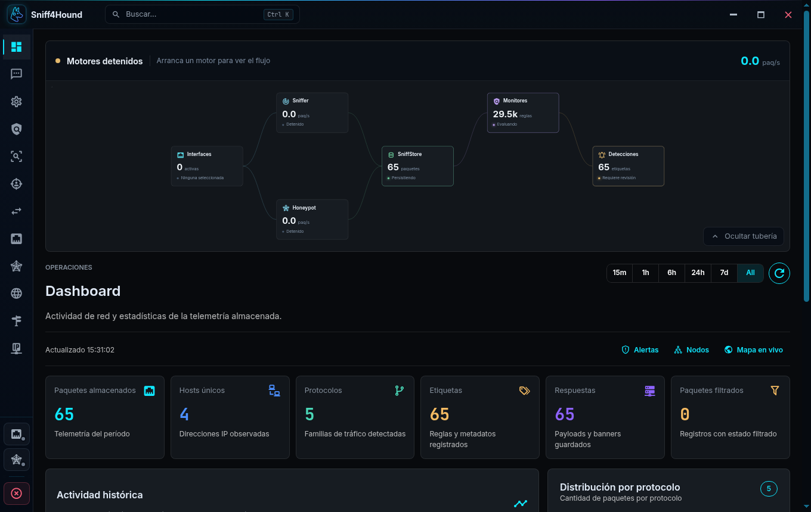
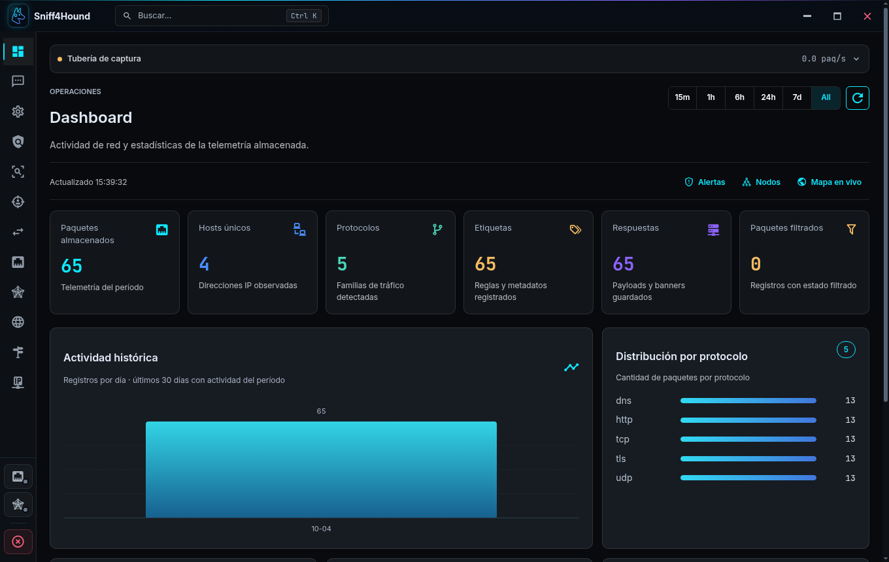
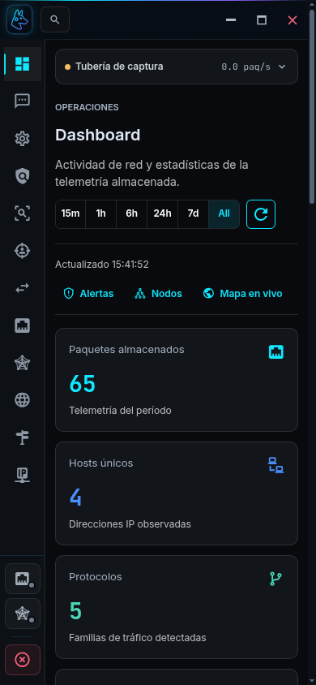
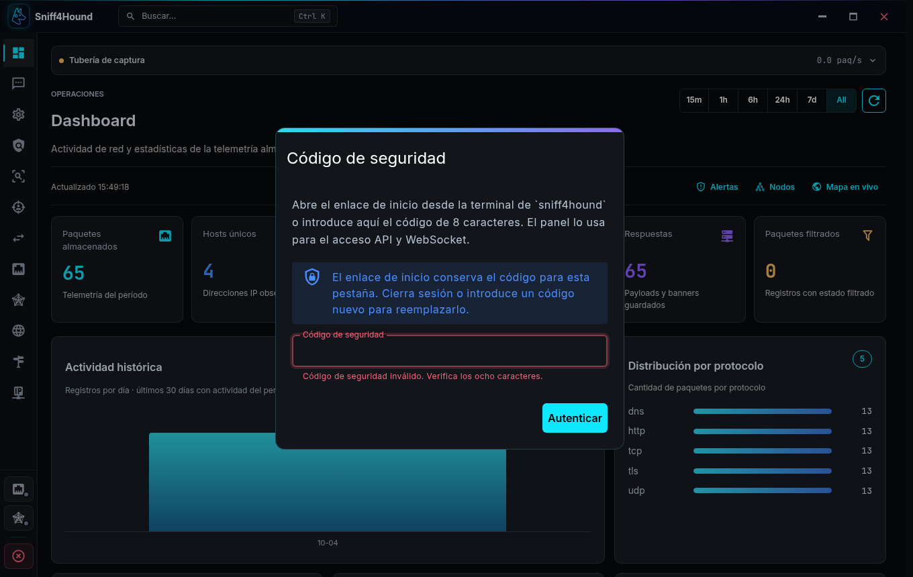

# Pulido visual de Electron · 2026-10-04

La revisión usa el frontend de producción cargado desde `app://shell` en
Electron 41. La instancia de prueba corre en un display independiente, con
configuración, certificados TLS y base de datos temporales. Sus 65 paquetes y
sus dominios son sintéticos; los motores permanecen detenidos.

## Cambios

- Superficies, bordes y radios compartidos; texto secundario con mayor contraste
  y barras de desplazamiento neutras.
- Foco de teclado visible en navegación, controles de motor, menús y búsqueda.
  Los campos conservan el color de validación y un halo acorde al estado.
- Tubería compacta al abrir una sesión nueva, con preferencia persistente y
  estados diferenciados para conexión detenida, captura activa y desconexión.
- Métricas alineadas y distribuidas en seis, tres, dos o una columna.
- Gráficos que se adaptan al ancho de la tarjeta y aceptan contadores largos.
- Cabeceras de tabla opacas, detalles JSON legibles y acciones de celda de 28 px.
- Paleta ajustada a la altura disponible y pie adaptable a ventanas estrechas.
- Pantalla de conexión con contraste y espaciado coherentes con la consola.

## Validación

`npm test` pasa el lint y las 40 pruebas del frontend. `npm run build` genera
correctamente el bundle de producción. `git diff --check` y la verificación de
sintaxis de los dos auditores también pasan.

El auditor de layouts revisó las 16 rutas actuales en 1360×860, 980×640,
768×1024, 390×844, 320×740 y 844×390: **96 layouts, cero incidencias y cero
excepciones JavaScript**. Comprueba anchura del documento, altura de los canvas,
tipografía, imágenes, desplazamiento de tablas, filas móviles y recortes del
inspector de configuración. Los reportes completos permanecen en
`QA/style-polish/` y no se versionan.

El auditor de estados revisó **55 estados adicionales**, sin controles ni textos
recortados ni excepciones: tablas de IP, contadores de caché y procesamiento,
confirmaciones de compactación y borrado (canceladas), exclusiones y formularios
y diálogos de regex con resultados largos.

La comprobación adicional de interacción revisó **44 estados** en cuatro
tamaños: foco de teclado, navegación, paleta y retorno del foco, expansión
persistente de la tubería, color de error, contadores largos, selector de
columnas, JSON expandido, carga/vacío y búsqueda del chat. También verificó
la preferencia de movimiento reducido. No hubo desbordamientos ni excepciones.

El launcher pasó en cinco tamaños, con todos los campos y botones accesibles
y desplazamiento vertical cuando la ventana es baja.

Los auditores se ejecutan desde la raíz contra una sesión dedicada de prueba:

```sh
SNIFF4HOUND_DESKTOP_DEBUG_PORT=9238 \
  QA_STYLE_VIEWPORTS='[[1360,860],[980,640]]' \
  QA_STYLE_OUTPUT=QA/style-polish/final/desktop \
  node scripts/qa_desktop_styles.js

NODE_PATH=/tmp/sniff4hound-style-qa/node_modules \
  QA_STYLE_FIXTURE_STATES=1 SNIFF4HOUND_DESKTOP_DEBUG_PORT=9238 \
  QA_STYLE_VIEWPORTS='[[1360,860],[980,640]]' \
  QA_STYLE_OUTPUT=QA/style-polish/states/desktop \
  node scripts/qa_desktop_states.js
```

Las capturas seleccionadas contienen exclusivamente la fixture sintética.

## Capturas

Antes, con la tubería expandida por defecto:



Después, con datos visibles y controles compactos:



Ventana estrecha de 390×844:



Validación visible en el campo y en el mensaje:


