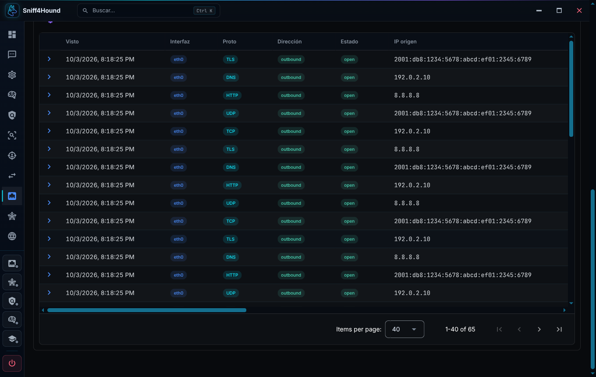
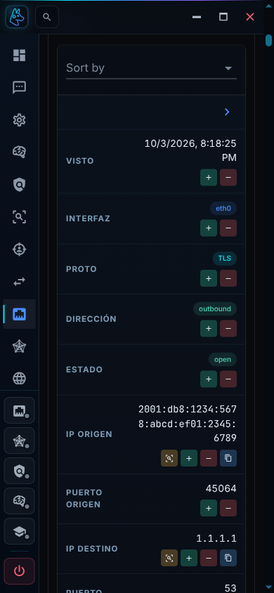

# Revision visual de Electron - 2026-10-03

## Alcance

Frontend de produccion cargado por Electron desde `app://shell`, ventana de
conexion y controles nativos. La revision usa una instancia independiente,
configuracion y base temporales, motores detenidos y paquetes sinteticos con
IPv6, rutas y contenido largo. No modifica datos operativos.

## Correcciones

- Recuperacion de las utilidades de tipografia antiguas tras migrar a Vuetify 4.
- Gutters consistentes, encabezados sin separadores superpuestos y altura
  compartida para las vistas de canvas.
- Superficies tonales sin tinte blanco acumulado; contraste de botones y
  campos nativos; placeholders que no se superponen a las etiquetas.
- Tablas con cabeceras fijas, scroll horizontal y vertical acotado en escritorio,
  filas moviles reales, contenido largo y acciones accesibles sin hover.
- Menus, avisos, dialogos y formularios con limites de viewport y capas coherentes.
- Paleta de comandos con foco al abrir desde la barra, cierre con Escape y
  devolucion del foco al disparador.
- Graficos ajustados al area visible; paneles de IA legibles y separados del grafo.
- Distribucion de metricas, formularios y chat adaptada a ventanas estrechas o bajas.
- Ventana de conexion desplazable, con la accion local visible a 980x640.
- Segunda pasada: dispositivos/IP sin overflow a 320px; etiquetas y valores
  apilados en las tablas mas estrechas.
- Acciones de exclusiones, creacion de regex y revision de IA sin botones
  recortados. Entradas largas de listas con anchura acotada y salto de linea.
- Acciones de ubicacion, retencion y confirmaciones de compactacion/borrado
  redistribuidas en ventanas estrechas; cabeceras de contadores de cache,
  procesamiento y recursos con salto de linea.
- Torneo de IA con una fila propia para los graficos de aprendizaje: ninguna
  candidata ni el resultado final quedan tapados al desplazar. Cabeceras,
  estados, epocas y perdida se redistribuyen sin colisionar.

## Auditoria reproducible

Requiere Node 22 o posterior y una instancia **dedicada a QA**, autenticada.
El script navega entre vistas y toma capturas; no guarda ajustes ni activa motores.
Las capturas pueden contener datos de la instancia y no deben publicarse sin revisar.

1. Ejecutar `npm test` y `npm run build` en `desktop/frontend`.
2. Lanzar una instancia aislada de Electron con
   `SNIFF4HOUND_DESKTOP_DEBUG_PORT=9227` y `ELECTRON_RUN_AS_NODE` desactivado.
   No cerrar una sesion existente para abrir este puerto sin consentimiento.
3. Conectar el backend de prueba. Desde la raiz del repositorio, ejecutar:

```sh
SNIFF4HOUND_DESKTOP_DEBUG_PORT=9227 node scripts/qa_desktop_styles.js
```

Por defecto recorre 19 rutas en 1360x860, 980x640, 768x1024 y 390x844.
Verifica overflow del documento, anchura de la aplicacion, altura del canvas,
tipografia, imagenes, scroll de tablas, presentacion movil, controles recortados
del inspector de configuracion y excepciones JS.
Guarda capturas y `report.json` en `QA/styles` (ignorado por Git).

`QA_STYLE_ROUTES` acepta rutas separadas por comas, `QA_STYLE_VIEWPORTS` una
matriz JSON de dimensiones y `QA_STYLE_OUTPUT` otro directorio de salida.
Para abrir formularios usar, por ejemplo, `/settings?section=storage`.
Los paneles de ajustes tambien necesitan inspeccion de su contenido al desplazarlo.

Para revisar estados condicionales hay un segundo auditor, basado en Playwright.
Requiere una fixture con IPs y paquetes que conserven bytes originales. Introduce
datos sinteticos **solo en memoria del frontend** para mostrar el torneo,
contadores del pipeline y editar un borrador regex; no guarda ajustes, no envia
revisiones y cancela los dialogos.
Se niega a ejecutarse sin la opcion explicita de fixture. No usarlo sobre una
sesion operativa. Playwright puede instalarse fuera del repositorio:

```sh
npm install --prefix /tmp/sniff4hound-visual-qa --no-package-lock playwright
NODE_PATH=/tmp/sniff4hound-visual-qa/node_modules \
  QA_STYLE_FIXTURE_STATES=1 SNIFF4HOUND_DESKTOP_DEBUG_PORT=9227 \
  node scripts/qa_desktop_states.js
```

Revisa tabla de IPs, contadores de cache/procesamiento, confirmaciones de
compactacion y dos alcances de borrado, exclusiones, formulario regex, ayudante
regex con resultado largo, revision de paquetes y torneo (arriba y al final del
scroll), en cinco dimensiones. Las capturas y el reporte quedan en `QA/styles/states`.

En Wayland, si las capturas se quedan en una transicion, lanzar solo la instancia
de QA con estas opciones:

```sh
npm run dev -- --ozone-platform=x11 --disable-renderer-backgrounding --disable-background-timer-throttling
```

El auditor espera a que terminen las
transiciones para no aprobar una vista anterior o invisible.

Cerrar la instancia de QA al terminar: el puerto CDP permite control completo
de la ventana y debe seguir siendo opt-in, cerrado en lanzamientos normales.

## Validacion

- `npm test`: lint sin errores y 40 pruebas aprobadas, incluidas cuatro nuevas
  regresiones de foco y Escape de la paleta de comandos.
- `npm run build`: bundle de produccion generado correctamente.
- 19 rutas en siete dimensiones (133 layouts): 1360x860, 980x640, 768x1024,
  390x844, 320x740, 844x390 y 1280x720, sin fallos en los criterios automatizados.
- 16 secciones de configuracion en cuatro dimensiones (64 layouts), incluidos
  controles internos fuera del primer viewport, sin fallos automatizados.
- 70 estados de fixture con `scripts/qa_desktop_states.js`, sin controles o
  textos recortados, superposiciones del torneo ni excepciones JS.
- 22 verificaciones con Playwright sobre el Electron real: paleta, navegacion,
  columnas, confirmacion de borrado, formularios de monitor/listener, inspector
  de IP, autenticacion y preview de paquetes, en escritorio y movil. Tambien
  se verificaron expansion JSON, ordenacion y paginacion de tablas.
- Mapas con pixeles no vacios y globo animado en ambos tamanos; zoom y reset
  comprobados. Las capturas y reportes quedan en `QA/styles`, no versionados.
- Tuberia expandida y los 16 nodos del grafo de configuracion completos dentro
  de su canvas, en escritorio y movil.
- `node --check` de ambos auditores y `git diff --check` sin errores.

El backend se utilizo solo como fixture para QA visual; esta revision no altera
su logica ni certifica las funciones de captura, deteccion o entrenamiento.

Las dimensiones menores que 980x640 se emulan mediante CDP para revisar el SPA;
no cambian el tamano minimo de la ventana nativa.

## Capturas de referencia

Estas dos capturas seleccionadas contienen unicamente datos sinteticos de QA:




